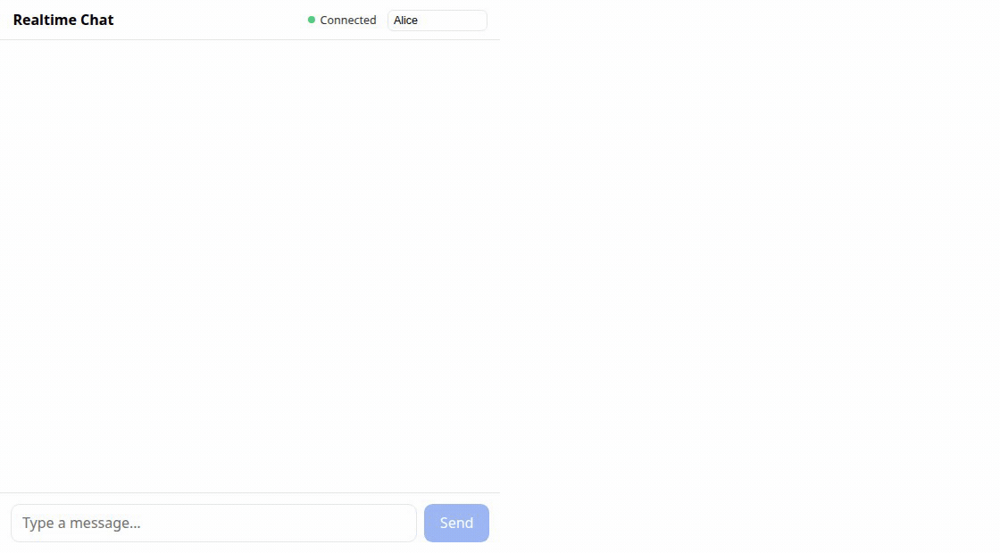
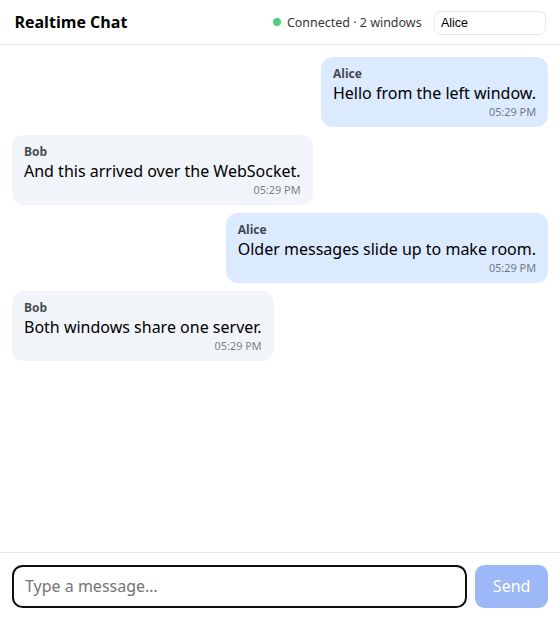
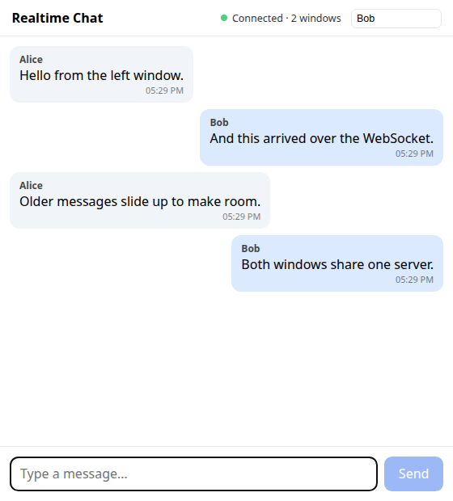

# Developer Screening Questions — Answers

**Candidate:** Hafiz Putra Ludyanto
**Role:** Full-Stack Developer (Golang + Vue.js)
**Repo:** https://github.com/fairyhunter13/web-dev-exercises

Every level is attempted, in the document's order, with the chat application last because it is
a project in its own right. Each question is quoted first and answered under it. Every code
block below was run before it was written down and runs as it stands when pasted into a
playground; [`README.md`](README.md) has the setup for the parts that run locally.

---

# Summary

> Depending on the job you’re interviewing for, you might not need to be able to answer all of these questions to get an interview.  If you don’t know how to do a section or a question, you can skip it.  However, if you’re interviewing for a senior position you should be able to answer all 3 levels for your role (Senior Backend Devs Must Complete the level 3 database question.  FrontEnd Devs must complete at least level 1 and level 2.)

Every section is answered, including all three database levels.

# How To Answer

> 1. Please answer the questions on an md file. We prefer that you host the md file on your own public git repo but you can also just attach the md file on your reply email. 
> 2. For coding questions, please make sure your code can be executed directly after copy pasted to any online js playground or fiddler and achieve the requested result.
> 3. For codes that need to be set up locally, please add the guideline on how to set up and execute your code.

This file is the md file, hosted on the public repo linked above. Every code block runs as it
stands when pasted into a playground, and [`README.md`](README.md) carries the setup and run
instructions for the parts that need a local environment.

---

# Basic Questions

> Imagine you're building a website that allows users to submit photos. One of the
> requirements is that each photo must be reviewed by a moderator before it can be
> published. How would you design the logic for this process? What technologies would
> you use? Do you have any data structure in mind to support this based on your
> technology of choice to handle those data?

## The design

*Every photo is reviewed before publication* drives two requirements, and those two shape
everything else.

1. Unpublished must be unreachable, not just unlinked. If "pending" is only a boolean the
   application checks, one code path that forgets the check publishes unreviewed content. The
   guarantee should come from infrastructure, so it does not depend on every code path being
   correct.
2. No classifier may auto-approve. A human sees every photo anyway, so automated moderation can
   only assist. That makes the ML component a priority signal, which is much easier to get right
   than a gate.

**Technologies:** Go for the API and workers, PostgreSQL for state and the review queue, S3 for
the bytes, SQS for image processing, CloudFront for delivery. Go and PostgreSQL are what I work
in daily; my own cloud depth is GCP and GKE, with AWS on one team.

Clients upload directly to S3 using a presigned POST policy rather than through the API. A
presigned PUT can only pin an *exact* `Content-Length`, so it cannot express "up to 5 MB" for a
file whose size you do not know when you issue the URL, and if you sign without it a client can
send 5 GB to a URL you issued expecting 5 MB. A POST policy's `content-length-range` and
`starts-with $key` conditions are enforced server side
([S3 POST policy conditions](https://docs.aws.amazon.com/AmazonS3/latest/API/sigv4-HTTPPOSTConstructPolicy.html)).

Two buckets, and approval copies between them:

- `photos-quarantine`: private, never a CloudFront origin, lifecycle-expired.
- `photos-public`: the only bucket the CDN can read, via Origin Access Control.

Approval copies the object from quarantine to public rather than flipping a flag. That is
requirement 1 made concrete: an unapproved photo is unreachable because it is not in any bucket
the CDN can read. The guarantee comes from IAM, which you can verify, instead of from every
future code path remembering an `if`. Serving is CloudFront with Origin Access Control in front
of the public bucket, and signed URLs for anything non-public. Keys are content-addressed and
immutable, so they cache with `max-age=31536000, immutable` — which means a takedown is a delete
plus a signed-URL key rotation, since invalidation cannot reach copies already in viewers'
browsers.

## The data model

```sql
CREATE TYPE photo_status AS ENUM (
  'uploading', 'pending_review', 'in_review',
  'approved', 'rejected', 'appealed', 'withdrawn'
);

CREATE TABLE photos (
  id              uuid PRIMARY KEY,
  uploader_id     uuid NOT NULL REFERENCES users(id),
  storage_key     text NOT NULL,          -- content-addressed: sha256 of the bytes
  status          photo_status NOT NULL DEFAULT 'uploading',
  priority        smallint NOT NULL DEFAULT 0,   -- written by the classifier
  submitted_at    timestamptz NOT NULL DEFAULT now(),
  assigned_to     uuid REFERENCES moderators(id),
  lease_expires_at timestamptz,
  decided_at      timestamptz,
  reason_code     text                     -- controlled vocabulary, see below
);

-- The table is dominated by decided rows, so a partial index keeps the hot
-- structure small, and its column list matches the claim query's WHERE and
-- ORDER BY exactly so the planner can use it whole.
CREATE INDEX photos_review_queue
  ON photos (priority DESC, submitted_at)
  WHERE status = 'pending_review';
```

```sql
-- Append-only. The app role gets INSERT and SELECT only:
--   REVOKE UPDATE, DELETE ON moderation_events FROM app_role;
-- Partitioned by month so retention is DETACH PARTITION rather than a mass
-- DELETE, which would leave the table bloated and vacuum-bound.
CREATE TABLE moderation_events (
  id            bigserial,
  photo_id      uuid NOT NULL,
  actor_id      uuid,               -- NULL when the actor is the classifier
  actor_kind    text NOT NULL,      -- 'human' | 'automated'
  from_status   photo_status,
  to_status     photo_status NOT NULL,
  reason_code   text,
  note          text,
  occurred_at   timestamptz NOT NULL DEFAULT now()
) PARTITION BY RANGE (occurred_at);
```

`photos.status` is a denormalised read model, written in the same transaction as the event. The
event log is the source of truth; the column exists so the queue query does not have to fold
history on every read. `reason_code` is a controlled vocabulary rather than a free-text note,
and `appealed` is a real status, because a restriction decision has to be contestable.

## The review queue

The review queue lives in Postgres and the image work goes to SQS.

- Human review goes to Postgres. It needs transactional consistency with the photo row,
  ordering that changes (priority, age, reviewer specialisation), reassignment when a
  moderator walks away, and an audit trail. SQS gives none of that.
- Image processing goes to SQS. Stateless, high volume, retry friendly, no ordering
  needs.

Claiming work:

```sql
-- SKIP LOCKED does the work here. Plain FOR UPDATE serialises moderators into a
-- single-file queue behind one lock, and no lock at all hands the same photo to
-- two people, who then disagree.
WITH claimed AS (
  SELECT id FROM photos
  WHERE status = 'pending_review'
  ORDER BY priority DESC, submitted_at
  FOR UPDATE SKIP LOCKED
  LIMIT 1
)
UPDATE photos p
SET status = 'in_review',
    assigned_to = $1,
    lease_expires_at = now() + interval '15 minutes'
FROM claimed c WHERE p.id = c.id
RETURNING p.*;
```

Then commit immediately, rather than holding the transaction open while the human looks at the
photo. A lease covers the think time instead, checked optimistically on the decision write:

```sql
UPDATE photos
SET status = $2, decided_at = now(), reason_code = $3, assigned_to = NULL
WHERE id = $1
  AND status = 'in_review'
  AND assigned_to = $4
  AND lease_expires_at > now();
-- 0 rows affected means the lease expired and someone else has it. The
-- moderator is told their decision did not apply, rather than silently
-- overwriting a colleague.
```

A sweeper returns expired leases to `pending_review`, which is how a moderator closing
their laptop mid-review self-heals.

Publishing to SQS and committing to Postgres cannot be made atomic, so the state change and its
domain event go into an `outbox` table in one transaction and a relay publishes afterwards. That
gives at-least-once delivery with idempotent consumers, keyed on the event id.

A [Rekognition](https://docs.aws.amazon.com/rekognition/latest/dg/moderation.html) pass runs on
upload and writes `priority`. It never changes `status`. Likely violations float to the top of
the queue so the worst content is seen in seconds instead of hours, and everything else is still
reviewed by a human.

---

# Database Questions (Skip if no experience)

> Open this link: [Basic SQL Emulator](https://www.w3schools.com/sql/trysql.asp?filename=trysql_select_all)

> 1. Notice all the tables available here:

**Dialect note.** The linked emulator is Microsoft SQL Server, where `LIMIT` is a syntax error
and a backtick-quoted identifier is rejected. All three answers are plain ANSI SQL with no
quoting and no row limit, so they run unchanged on SQL Server, MySQL, PostgreSQL and SQLite.
Each was executed in the emulator and the output captured.

## Level 1 — how many customers are from Germany

> Level 1 (Novice - Expected Task Time: 1 minute):
>
> Write a SQL query that shows me how many customers there are from Germany.

[`sql/level1_germany_count.sql`](sql/level1_germany_count.sql)

```sql
SELECT COUNT(*) AS GermanCustomers
FROM Customers
WHERE Country = 'Germany';
```

**Result: 11.** (`docs/evidence/sql-l1.png`)

`COUNT(*)` rather than `COUNT(Country)`: they are equal here, but `COUNT(column)` skips NULLs,
so the two diverge the moment the column becomes nullable.

## Level 2 — countries by customer count, excluding fewer than 5

> Level 2 (Business Admin - Expected Task Time <4 minutes):
>
> Write a query that shows me a list of the countries that have the most customers; from most
> customers to least customers.  Don’t show countries that have less than 5 customers.

[`sql/level2_customers_per_country.sql`](sql/level2_customers_per_country.sql)

```sql
SELECT COUNT(CustomerID), Country
FROM Customers
GROUP BY Country
HAVING COUNT(CustomerID) >= 5
ORDER BY COUNT(CustomerID) DESC, Country DESC;
```

**Result — 7 rows** (`docs/evidence/sql-l2.png`):

| COUNT(CustomerID) | Country |
|---|---|
| 13 | USA |
| 11 | Germany |
| 11 | France |
| 9 | Brazil |
| 7 | UK |
| 5 | Spain |
| 5 | Mexico |

`HAVING` rather than `WHERE`, because the filter is on an aggregate and `WHERE` runs before
grouping, when the aggregate does not exist yet.

`Country DESC` is the second `ORDER BY` key because France and Germany both have 11 and Spain
and Mexico both have 5, and rows tying on the sort key are not otherwise guaranteed an order.
It makes the result deterministic and reproduces the ordering in your screenshot.

## Level 3 — reverse-engineered from the result set

> Level 3 (Average Developer - Expected Task Time <8 minutes):
>
> Reverse Engineer These Results (tell me the query that we need to write to get these
> results):

[`sql/level3_customer_order_summary.sql`](sql/level3_customer_order_summary.sql)

Reading the target back to a query, column by column. `CustomerName` comes from `Customers`.
`OrderCount` is a `COUNT` over `Orders`, so an aggregate join is needed. `FirstOrder` and
`LastOrder` are `MIN` and `MAX` of `OrderDate`. The rows give the rest: every customer shown
has at least 5 orders, and `LastOrder` descends down the page.

```sql
SELECT c.CustomerName,
       COUNT(o.OrderID) AS OrderCount,
       MIN(o.OrderDate) AS FirstOrder,
       MAX(o.OrderDate) AS LastOrder
FROM Customers c
JOIN Orders o ON o.CustomerID = c.CustomerID
GROUP BY c.CustomerID, c.CustomerName
HAVING COUNT(o.OrderID) >= 5
ORDER BY LastOrder DESC;
```

**Result — 9 rows, matching the target in names, counts, dates and ordering**
(`docs/evidence/sql-l3.png`).

| CustomerName | OrderCount | FirstOrder | LastOrder |
|---|---|---|---|
| Ernst Handel | 10 | 1996-07-17 | 1997-02-11 |
| Mère Paillarde | 5 | 1996-10-17 | 1997-02-07 |
| Wartian Herkku | 7 | 1996-07-26 | 1997-02-05 |
| Split Rail Beer & Ale | 6 | 1996-08-01 | 1997-01-31 |
| Hungry Owl All-Night Grocers | 6 | 1996-09-05 | 1997-01-29 |
| La maison d'Asie | 5 | 1996-11-11 | 1997-01-24 |
| QUICK-Stop | 7 | 1996-08-05 | 1997-01-17 |
| Rattlesnake Canyon Grocery | 7 | 1996-07-22 | 1997-01-01 |
| LILA-Supermercado | 5 | 1996-08-16 | 1996-12-12 |

`JOIN`, not `LEFT JOIN`: a customer with zero orders can never satisfy `>= 5`. The `GROUP BY`
carries `c.CustomerID` as well as `c.CustomerName`, because names are not unique and grouping by
the key stops two same-named customers collapsing into one row.

---

# JavaScript/TypeScript Questions

> Answer as many levels as you can… the level you reach will only affect the type of position
> you’re qualified for - we have many positions available.  But if you don’t complete level 1,
> you won’t get an interview.

Every code block below runs unmodified when pasted into a browser playground, which is what the
question asks for. Each was extracted from this page and run on its own to confirm it prints the
requested result. They are also plain modules under Node, with a vitest suite:

```
$ cd js && npm install && npm test
 Test Files  4 passed (4)
      Tests  64 passed (64)
```

## Level 1 — Title Case

> Level 1: Expected Task Time <15 minutes.
>
> Make a javascript or typescript function that converts any string to Title Case.
>
> Expected Results:
>
> titleCase("I'm a little tea pot") should return a string.
>
> titleCase("I'm a little tea pot") should return "I'm A Little Tea Pot".
>
> titleCase("sHoRt AnD sToUt") should return "Short And Stout".
>
> titleCase("SHORT AND STOUT") should return "Short And Stout".

[`js/src/titleCase.js`](js/src/titleCase.js)

```js
function titleCase(input) {
  return String(input).replace(/\p{L}[\p{L}\p{M}'’]*/gu, (word) => {
    const [first, ...rest] = word;
    return first.toUpperCase() + rest.join('').toLowerCase();
  });
}

// The four cases from the question.
console.log(typeof titleCase("I'm a little tea pot")); // "string"
console.log(titleCase("I'm a little tea pot")); // I'm A Little Tea Pot
console.log(titleCase('sHoRt AnD sToUt')); // Short And Stout
console.log(titleCase('SHORT AND STOUT')); // Short And Stout
```

All four expectations from the question pass, verified in both Node and a browser:

| Input | Output |
|---|---|
| `"I'm a little tea pot"` | `"I'm A Little Tea Pot"` |
| `typeof titleCase("I'm a little tea pot")` | `"string"` |
| `"sHoRt AnD sToUt"` | `"Short And Stout"` |
| `"SHORT AND STOUT"` | `"Short And Stout"` |

The regex is shaped by the apostrophe. `\b\w` treats `'` as a word boundary, so `don't` becomes
`Don'T`, and `\w` is ASCII only, so `mère` breaks. Putting `'’` in the character class keeps
contractions intact and `\p{L}\p{M}` handles combining marks. Matching words rather than
`split(" ")` also preserves the original spacing, including the double and triple spaces in the
word-frequency string below.

## Level 1 (alternative) — word frequency

> Or
>
> Create a function that counts the word frequency in this string "Four One two two three
> Three three four  four   four".  Case insensitive, ignore punctuation.
>
> Expected Answer:
>
> one => 1
>
> two => 2
>
> three => 3
>
> four => 4

[`js/src/wordFrequency.js`](js/src/wordFrequency.js)

```js
function wordFrequency(input) {
  const counts = new Map();

  for (const [word] of String(input).matchAll(/[\p{L}\p{N}][\p{L}\p{M}\p{N}'’]*/gu)) {
    const key = word.toLowerCase().replace(/['’]+$/u, '');
    counts.set(key, (counts.get(key) ?? 0) + 1);
  }

  return counts;
}

const input = 'Four One two two three Three three four  four   four';

for (const [word, count] of wordFrequency(input)) {
  console.log(`${word} => ${count}`);
}
```

Output for the question's string, captured from `node js/src/wordFrequency.js`:

```
four => 4
one => 1
two => 2
three => 3
```

The counts are the four the question expects. The *order* is first appearance, because a `Map`
iterates in insertion order and the string begins with "Four". A `Map` rather than a plain
object also means a word like `constructor` or `__proto__` counts as itself instead of colliding
with a prototype key.

## Level 2 — `delay(ms)` with promises

> Level 2:  Expected Task Time 1 minute.
>
> Fix this code, using promises:
>
> ```js
> function delay(ms) {
>  // add promise code here
> }
>
> delay(3000).then(() => alert('runs after 3 seconds'));
> ```

[`js/src/delay.js`](js/src/delay.js)

```js
function delay(ms) {
  return new Promise((resolve) => setTimeout(resolve, ms));
}

delay(3000).then(() => alert('runs after 3 seconds'));
```

`resolve` is passed straight to `setTimeout` rather than wrapped in an arrow function, so
nothing is captured that does not need to be.

The call is the question's own, `alert` included, so it runs as written in a browser playground.
`alert` does not exist in Node, so the file substitutes `console.log` when there is no `alert`
to call.

## Level 2.5 — rewrite with async/await

> Level 2.5: Rewrite using Async/Await:

The code the question supplies, quoted in full:

```js
function fetchData(url, callback) {

  setTimeout(() => {

    if (!url) {

      callback("URL is required", null);

    } else {

      callback(null, `Data from ${url}`);

    }

  }, 1000);

}

function processData(data, callback) {

  setTimeout(() => {

    if (!data) {

      callback("Data is required", null);

    } else {

      callback(null, data.toUpperCase());

    }

  }, 1000);

}

// Using callbacks

fetchData("https://example.com", (err, data) => {

  if (err) {

    console.error("Fetch Error:", err);

  } else {

    processData(data, (err, processedData) => {

      if (err) {

        console.error("Process Error:", err);

      } else {

        console.log("Processed Data:", processedData);

      }

    });

  }

});
```

[`js/src/asyncAwait.js`](js/src/asyncAwait.js)

`fetchData` and `processData` are left exactly as the question gave them, and only the calling
code changes. This is the same refactor you would do against a dependency you do not own:

```js
// --- unchanged from the question -------------------------------------------
function fetchData(url, callback) {
  setTimeout(() => {
    if (!url) {
      callback("URL is required", null);
    } else {
      callback(null, `Data from ${url}`);
    }
  }, 1000);
}


function processData(data, callback) {
  setTimeout(() => {
    if (!data) {
      callback("Data is required", null);
    } else {
      callback(null, data.toUpperCase());
    }
  }, 1000);
}

// --- the rewrite ------------------------------------------------------------
const promisify =
  (fn) =>
  (...args) =>
    new Promise((resolve, reject) => {
      fn(...args, (err, value) => (err ? reject(new Error(err)) : resolve(value)));
    });

const fetchDataAsync = promisify(fetchData);
const processDataAsync = promisify(processData);

async function main() {
  try {
    const data = await fetchDataAsync('https://example.com');
    const processed = await processDataAsync(data);
    console.log('Processed Data:', processed);
  } catch (error) {
    console.error('Error:', error.message);
  }
}

main();
// Processed Data: DATA FROM HTTPS://EXAMPLE.COM

// The error path, to show the single `catch` covers both stages. It prints
// first because it only waits on one 1s timer rather than two.
fetchDataAsync('')
  .then((d) => console.log('unexpected success:', d))
  .catch((e) => console.error('Error:', e.message)); // Error: URL is required
```

Output, in the order the demo actually emits it: the failure path prints
`Error: URL is required` first, then the success path prints
`Processed Data: DATA FROM HTTPS://EXAMPLE.COM`.

The nesting disappears, but the change that matters is the errors. The originals call back with
a *string*, `"URL is required"`, which has no stack and cannot be caught by any `catch` up the
chain; rejecting with `new Error(err)` fixes both. That is a bug in the supplied code, not just
a style difference. `promisify` is inlined here so the file runs unchanged in a playground —
Node's `util.promisify` is what I would use in a real project.

## Level 3-4 — real-time chat

> Level 3-4: Expected Task Time Less Than 1 Hour.
>
> Create a real-time chat between two windows; using web sockets, vuejs and typescript.  Bonus
> if you add some nice, simple animations.
>
> If you have no experience with web sockets, just make two chat windows side-by-side in the
> different browser window.  Show messages being sent between the two chat screens.  As new
> messages come in, old messages slide upwards to make room for new messages.
>
> If you’d like to be considered for a senior role or lead role, please deploy to AWS and send
> me a link to your working application.
>
> See example below:

See the [Chat Application](#chat-application) section below.

---

# Vue.js

> * Explain Vue.js reactivity and common issues when tracking changes.
> * Describe data flow between components in a Vue.js app
> * List the most common cause of memory leaks in Vue.js apps and how they can be solved.
> * What have you used for state management
> * What’s the difference between pre-rendering and server side rendering?

To be clear about the level first: I have about a year with Vue, which is what I put on your
application form. My depth is backend Golang, and frontend work has been secondary throughout my
career. The answers below are written against the current Vue 3 documentation, not from memory.

## 1. Vue.js reactivity, and common issues when tracking changes

Vue 3 wraps a reactive object in a [Proxy](https://vuejs.org/guide/extras/reactivity-in-depth.html).
Property access goes through a `get` trap that records the currently running effect as a
dependency of that property. A `set` trap re-runs the effects that depend on it. `ref()` is
the same mechanism with the value behind a `.value` getter and setter, which is why refs
work for primitives and `reactive()` does not.

That is the Vue 2 to Vue 3 dividing line. Vue 2 used `Object.defineProperty`, which could not
detect property addition or removal and needed `Vue.set` or `this.$set`. Vue 3 removed `Vue.set`
entirely: the Proxy makes it unnecessary, and adding a new property or assigning to an array
index is tracked normally.

The caveats that *are* real in Vue 3:

- `reactive()` only works on object types: objects, arrays, `Map`, `Set`. It silently
  does nothing for a primitive. Use `ref()` there.
- You cannot replace the whole reactive object. `state = reactive({...})` throws away
  the proxy every existing effect is subscribed to, and the UI stops updating. Mutate it, or
  use a `ref` and replace `.value`.
- Destructuring loses reactivity. `const { count } = state` copies the current value out
  of the proxy, and nothing tracks it afterwards. `toRefs(state)` is the fix.
- Refs are not unwrapped inside arrays or collections. A ref at the top level of a
  reactive object unwraps. The same ref inside an array needs `.value`.
- Template unwrapping only applies to top-level properties, and the exception is narrower
  than people usually state it. `{{ object.someRef }}` does render the value, because a ref
  that is the final evaluated value of an interpolation gets unwrapped. What breaks is a
  compound expression: `{{ object.someRef + 1 }}` renders `[object Object]1`, and
  `v-if="object.someRef"` is always truthy. `toRefs()`, or hoisting the ref to the top level,
  is the fix.
- Watchers created asynchronously are not auto-stopped. See memory leaks below.

Habits cause trouble as well as mechanics. Mutating a prop object works, but it is a
maintenance trap, because the child now quietly owns the parent's state. So does reaching for
`watch` where a `computed` would do: a `computed` is cached and declarative, while a `watch`
is imperative and runs whether or
not anyone reads the result.

## 2. Data flow between components

Vue's model is [one-way down, events up](https://vuejs.org/guide/components/props.html#one-way-data-flow).
Props are a one-way binding. Parent changes flow into the child, and the child must not
write back. In dev mode Vue warns if you assign to a prop directly.

- **Down:** `defineProps`. If the child needs to shape a value locally, copy it into a local
  `ref` or derive it with a `computed`.
- **Up:** `defineEmits`. The child emits, the parent decides. The two-way sugar is `v-model`
  on a component, which in Vue 3.4+ is `defineModel()`, one macro in place of the old
  `modelValue` prop and `update:modelValue` emit pair. Vue 2's `.sync` modifier is gone.
- **Sideways or deep:** `provide` and `inject`, for something like a theme or a service
  handle that a whole subtree needs. Use it sparingly, because it creates a coupling that
  does not show up in a component's signature. `useTemplateRef()` (3.5+) gets you a direct
  child handle, paired with `defineExpose` on the child.
- **Anything shared across the app:** a store, not an event bus. `$on` and `$off` were
  removed in Vue 3, and the pattern was hard to trace anyway.

## 3. Most common cause of memory leaks, and how they can be solved

Ranked by how often they come up:

1. Listeners and timers on things Vue does not own: `window.addEventListener`,
   `setInterval`, `IntersectionObserver`, a WebSocket. Vue tears down its own bindings on
   unmount, and it knows nothing about these. Remove them in `onUnmounted`, or use VueUse's
   `useEventListener`, which does it for you.
2. [Watchers and effects created asynchronously](https://vuejs.org/guide/essentials/watchers.html#stopping-a-watcher).
   Watchers created synchronously in `setup()` are bound to the component and stop on unmount.
   A watcher created inside an `await`, a `setTimeout` or a callback is not, and it leaks.
   Keep them synchronous, or capture the returned stop handle and call it, or wrap the async
   work in an `effectScope()` and dispose the scope.
3. Detached DOM held by a template ref or a closure. A ref to an element kept in a
   module-level variable pins the whole subtree.
4. Module-level state that only grows. A module-scoped array pushed to on every navigation
   is never garbage, because it is reachable by design. Bound it, or move it into a store with
   an explicit reset.
5. SSR cross-request state pollution. A store or reactive object created at module scope on
   the server is shared by every request, which is a memory leak and a data leak at once. The
   fix is a factory that builds fresh state per request, which is why Pinia stores are defined
   as functions.

Vue ships tools for two of these. `effectScope()` with `onScopeDispose()` groups effects created
outside a component so they can be disposed as a unit, and `onWatcherCleanup()` (3.5+) cancels
in-flight work when a watcher re-runs.

To diagnose: Chrome DevTools Memory, two heap snapshots around a mount and unmount cycle, then
compare the delta and look for detached nodes and retained component instances.

## 4. State management

My hands-on state-management work is on the React side, and even there it is more reading than
writing. On Vue 3 I have an informed preference and no production mileage, so this is
what I would pick and why.

- **Pinia** is what I would reach for on Vue 3, and it is the
  [officially recommended](https://pinia.vuejs.org/) store. A setup store is a `setup()`
  function returning refs and functions, so it reads like a composable and types itself
  without helper generics.
- **Vuex** is in maintenance mode and no longer recommended for new projects. Pinia drops
  mutations entirely, since actions mutate state directly, and that removes most of the Vuex
  ceremony.
- On the React side at FrankieOne I worked alongside a Redux Toolkit and React Query codebase.
  My work there was backend, and I read that state layer more than I wrote it.

The judgment I would apply: use a store only for state that spans unrelated parts of the tree,
such as session, permissions and notifications. Server data belongs in a query cache like
TanStack Query or VueUse's `useAsyncState` rather than hand-rolled into a store, since a store
makes you re-implement caching, invalidation and request dedup yourself. Everything else stays
local, and `provide` with `inject` covers the middle ground.

## 5. Pre-rendering vs server side rendering

Both produce real HTML before any JavaScript runs, so both fix the blank-page and crawler
problems of a pure SPA. The difference is *when* the render happens.

- **Pre-rendering, or SSG,** renders once at build time to a static file. It serves from a CDN,
  costs nothing per request and cannot go down under load. It cannot show per-request data, so
  there is no per-user content, and anything that changes means a rebuild.
- **SSR** renders per request on a server. It can personalise and show live data. The price is
  running and scaling servers, a TTFB that includes render time, and code that has to be
  isomorphic, with no `window` and no per-request state at module scope.

Wherever the page ships a client bundle, both hand off to hydration and share its cost. The JS
still has to download and attach before the page is interactive, so a fast first paint with a
slow INP is the typical failure of both. A pre-rendered page that ships no client bundle never
hydrates and pays none of that.

Most real sites use the middle ground — ISR and partial hydration — which are Nuxt and Nitro
capabilities rather than Vue core.

My rule of thumb: content that is the same for everyone goes to SSG, per-user or real-time
content goes to SSR, and an authenticated dashboard behind a login needs neither, so ship the
SPA. There is nothing to index and nothing cacheable.

---

# Website Security Best Practises

> Tell me all the security best practices you can think of - start with the most important
> ones first.

Ordered most important first, following the [OWASP Top 10:2025](https://owasp.org/Top10/).

1. **Broken access control.** Authorise every request, on the server, per object.
   Still #1, and it now absorbs SSRF. The common real-world bug is IDOR: the endpoint checks
   that you are logged in but not that the record belongs to you. Deny by default, and make
   the ownership check part of the data access path, as a scoped query such as
   `WHERE tenant_id = $current`, rather than a separate `if` that a future endpoint can
   forget. Never trust a client-supplied role, id or price.

2. **Security misconfiguration.** Default credentials, debug mode in
   production, an S3 bucket that is public because someone was in a hurry, permissive CORS
   (`Access-Control-Allow-Origin: *` together with credentials), verbose stack traces in
   responses, unnecessary ports open. Harden by default and keep the config in version
   control so a drift is visible.

3. **Software supply chain.** Lockfiles committed, dependencies pinned,
   `npm audit` / `govulncheck` in CI,
   Dependabot on, and a build that fails on a high-severity advisory instead of printing a
   warning nobody reads. This is broader than "old library" now, and covers the build system,
   the CI runners and the publishing pipeline.

4. **Cryptographic failures.** TLS everywhere, and hash passwords properly.
   HTTPS with HSTS, and nothing sensitive in a URL, a log or `localStorage`. For passwords,
   Argon2id, or scrypt, or bcrypt at a current cost. Never SHA-256, never unsalted. Encrypt at
   rest and keep the keys in a KMS or secret manager, never in the repo. Two pieces of
   common advice are now wrong and worth unlearning:
   [NIST SP 800-63B](https://pages.nist.gov/800-63-4/sp800-63b.html) says not to force
   periodic password rotation and not to impose composition rules, because both push users
   toward predictable patterns. Check candidate passwords against a breach list instead, and
   allow long passphrases.

5. **Injection.** Parameterise, always. Prepared statements or a query builder, never string
   concatenation, including in the internal admin tool nobody outside can reach. The same
   applies to OS commands, where you pass an argument array and never a shell string, and to
   templates. XSS lives here too: encode on output, in context, and let the framework do it.
   Vue's `{{ }}` escapes, and the risk concentrates in the escape hatches, `v-html`,
   `innerHTML` and `dangerouslySetInnerHTML`. Sanitise with DOMPurify where user HTML is
   genuinely required. "Escape on input" is the wrong model, because the right encoding
   depends on where the value lands.

6. **Insecure design.** Threat-model the feature before writing it. Rate limits on
   authentication and on anything expensive, lockout and step-up on suspicious activity, and
   business-logic invariants enforced on the server, with quantity, price and discount all
   recomputed there.

7. **Authentication and session management.** MFA available and enforced for administrators.
   Session cookies `HttpOnly`, `Secure`, `SameSite=Lax` (or `Strict`), scoped and short-lived,
   and rotated on privilege change to close session fixation. Tokens in cookies, since any
   XSS can read `localStorage`. Generic failure messages, so login does not
   enumerate accounts. Password reset through a single-use, short-lived, high-entropy token,
   and not security questions, which NIST now prohibits outright as an authenticator.

8. **Integrity of data and pipeline.** Verify signatures on artefacts and updates. Do not
   deserialise untrusted input into arbitrary types. Use Subresource Integrity on
   third-party scripts you have to include. Protect CI secrets, because a compromised
   pipeline compromises everything it deploys.

9. **Logging, monitoring and alerting.** Log authentication events, access-control failures and
   admin actions with enough context to reconstruct an incident, and never log passwords, tokens
   or full card numbers. Alert on anomalies. Have an incident response plan before you need one.

10. **Handling exceptional conditions.** Fail closed: an authorisation check that
    throws must deny, never fall through. Do not swallow errors, do not leak internals in
    an error response, and make sure a timeout or a partial failure leaves the system in a
    defined state instead of half-committed.

Cross-cutting, and specific to a browser app:

- CSRF. The lead recommendation is now
  [Fetch Metadata](https://cheatsheetseries.owasp.org/cheatsheets/Cross-Site_Request_Forgery_Prevention_Cheat_Sheet.html)
  (`Sec-Fetch-Site`), with a synchroniser token or an HMAC-signed double-submit cookie as the
  stateless fallback. `SameSite` cookies help but are not enough on their own. The naive
  double-submit cookie, comparing an unsigned cookie to a form field, can be bypassed through
  subdomain cookie injection and should not be used.
- Content-Security-Policy with a per-request nonce and `strict-dynamic` rather than a host
  allowlist. Allowlists are easy to bypass through JSONP endpoints and hosted libraries on
  allowed CDNs. Then `X-Content-Type-Options: nosniff`,
  `Referrer-Policy: strict-origin-when-cross-origin`, and a restrictive `Permissions-Policy`.
- Obsolete headers, to remove if present: `X-XSS-Protection`, whose auditor was itself
  exploitable and is gone from every modern browser, `Expect-CT`, and HPKP.
  `X-Frame-Options` is superseded by CSP `frame-ancestors`, though sending both is harmless
  for old clients.
- Uploads. Validate by sniffing content, not by extension. Re-encode images. Store
  them outside the web root or on a separate origin, so a served file cannot execute in your
  site's context. Cap size at the storage layer as well as in the app.
- Least privilege everywhere. The database user the app connects as should not be able to
  `DROP TABLE`.

---

# Website Performance Best Practises

> Tell me all the performance best practices you can think of - start with the most important
> ones first.

Ordered most important first, measured against
[Core Web Vitals](https://web.dev/articles/vitals), whose current p75 targets are LCP ≤ 2.5 s,
INP ≤ 200 ms and CLS ≤ 0.1. INP replaced FID in March 2024.

1. Measure first, on real users. Field data from CrUX or RUM beats lab data, because a lab
   run on a fast laptop and fibre hides the p75 that counts. Lighthouse and WebPageTest for
   diagnosis, `web-vitals.js` for the field.

2. Ship less JavaScript. It is the biggest single lever on INP. JS costs on every axis,
   download, parse, compile and execute, and unlike an image it blocks the main thread.
   Route-level code splitting with dynamic `import()`, tree shaking, and an audit of heavy
   dependencies such as a date library, a whole icon set, or a charting library imported for
   one chart. Enforce it with a bundle-size budget that fails the build.

3. Optimise the LCP element. Work out what it actually is first, usually a hero image or a
   headline. Then `fetchpriority="high"`, `<link rel="preload">`, and never `loading="lazy"` on
   it, which is a documented anti-pattern that delays the exact thing you are scored on. Keep
   client-side fetches out of its critical path. Use modern formats, AVIF or WebP, sized
   correctly with `srcset` and `sizes`, and lazy-load everything below the fold.

4. Eliminate layout shift. Explicit `width` and `height`, or `aspect-ratio`, on every
   image, video and iframe. Reserve space for ads, embeds and banners. Use `font-display:
   swap` with a metric-matched fallback via `size-adjust`, so the swap does not reflow. Never
   insert content above existing content after load.

5. Keep the main thread free, which is what INP measures. Break up long tasks over 50 ms.
   Yield with `scheduler.yield()` where it exists, `postTask` or `setTimeout(0)` otherwise.
   Debounce and throttle input handlers, and move heavy computation to a Web Worker. Use
   `content-visibility: auto` for offscreen sections and virtualise long lists. Animate with
   CSS transforms and opacity so the work stays off the main thread, which is why the chat
   app's message animation is transform-only.

6. Cache aggressively and correctly. Immutable, content-hashed filenames with
   `Cache-Control: max-age=31536000, immutable`. Short TTL plus `ETag` on HTML.
   `stale-while-revalidate` for the middle ground. A CDN in front of everything static. On the
   server, cache expensive queries and computed responses in Redis, with a real invalidation
   strategy behind it.

7. Fix the backend and the database. TTFB gates every other metric, because nothing renders
   before the first byte. Index for the queries you actually run, using `EXPLAIN ANALYZE`.
   Kill N+1 queries, paginate, pool connections, and move anything that does not have to
   happen inside the request into a queue. Compress with Brotli, and run
   HTTP/2 or HTTP/3 end to end.

8. Reduce and prioritise network work. Preconnect to critical third-party origins,
   preload critical fonts, self-host and subset them, inline critical CSS and defer the
   rest, and put `defer` or `async` on scripts. Audit third-party tags hard. Analytics, chat
   widgets and tag managers are often the largest single cost on a page and the easiest to
   cut.

9. Prefetch the next navigation. `<link rel="prefetch">` or the Speculation Rules API for
   the likely next route makes it feel instant. It is cheap, and often the biggest perceived
   improvement per line of code.

Some advice on older lists is now wrong and should be dropped. HTTP/2 Server Push was removed
from Chrome and replaced by `103 Early Hints` plus preload. Domain sharding was an HTTP/1.1
workaround that hurts under HTTP/2 multiplexing. Concatenating everything into one bundle
defeats caching and code splitting. Base64-inlining images bypasses caching and inflates the
parent file by about a third. And `document.write` should not be used at all.

---

# Golang (if interviewing for a Golang job) / .NET Candidate

> https://goplay.tools/ or use https://dotnetfiddle.net/ for .Net candidate.

> Create a function that counts the word frequency in this string
> "Four, One two two three Three three four  four   four".  Case insensitive, ignore
> punctuation.
>
> Expected Answer (order doesn’t matter):
>
> one => 1
>
> two => 2
>
> three => 3
>
> four => 4

**Runnable playground link:** https://goplay.tools/snippet/BXc4V_djJRw, which is the
playground your document names. The same snippet on the official playground is
https://go.dev/play/p/BXc4V_djJRw. Both were opened and run on Go 1.26, with the output
captured in `docs/evidence/go-playground.png`.

Source: [`go/wordfreq/main.go`](go/wordfreq/main.go) · tests:
[`go/wordfreq/main_test.go`](go/wordfreq/main_test.go)

```go
package main

import (
	"fmt"
	"maps"
	"slices"
	"strings"
	"unicode"
)

func WordFrequency(s string) map[string]int {
	const apostrophes = "'’"

	// FieldsFunc, not Fields. strings.Fields only splits on whitespace, which
	// leaves the comma attached to "Four," and produces a separate key from
	// "four". Splitting on "not a letter or digit" strips punctuation and
	// collapses the runs of multiple spaces in one pass.
	isSeparator := func(r rune) bool {
		// Apostrophes are kept so "don't" stays one word; they are trimmed
		// from the edges below so a quoted 'word' is not a different word.
		if strings.ContainsRune(apostrophes, r) {
			return false
		}
		// Combining marks are kept too, so an "é" written as "e" plus U+0301
		// is not split into "e" and counted as a different word from "é".
		return !unicode.IsLetter(r) && !unicode.IsDigit(r) && !unicode.Is(unicode.M, r)
	}

	counts := make(map[string]int)
	for _, field := range strings.FieldsFunc(s, isSeparator) {
		word := strings.Trim(field, apostrophes)
		if word == "" {
			continue
		}
		counts[strings.ToLower(word)]++
	}
	return counts
}

func main() {
	const input = "Four, One two two three Three three four  four   four"

	counts := WordFrequency(input)

	// Map iteration order in Go is deliberately randomised, so sort the keys to
	// make the output reproducible. slices.Sorted consumes the iterator that
	// maps.Keys returns (Go 1.23+); it does not take a slice.
	for _, word := range slices.Sorted(maps.Keys(counts)) {
		fmt.Printf("%s => %d\n", word, counts[word])
	}
}
```

Output:

```
four => 4
one => 1
three => 3
two => 2
```

The interesting part of this question is the punctuation and the double spaces.

- `strings.FieldsFunc`, not `strings.Fields`. `Fields` splits on whitespace only, so `"Four,"`
  keeps its comma and counts separately from `"four"`. `FieldsFunc` with a "not a letter or
  digit" predicate strips punctuation and collapses the double and triple spaces in the same
  pass. The predicate tests `unicode.IsLetter` rather than a byte range, so it is correct for
  non-ASCII input.
- Deterministic output. Go randomises map iteration order, so `main` prints via
  `slices.Sorted(maps.Keys(counts))`.

`go test ./...` passes, including a case that calls `main()` with `os.Stdout` swapped for a
pipe, so the sorted output above is asserted rather than described.

---

# Tools (rated 1 to 5)

> Tools (Rate yourself 1 to 5)
>
> * Git
> * Redis
> * VSCode / JetBrains?
> * Linux?
> * AWS
> * EC2
> * Lambda
> * RDS
> * Cloudwatch
> * S3
> * Unit testing
> * Kanban boards?

Rated against one scale, so that a 4 means something. **1**: have read about it. **2**: have
used it, but not enough to be relied on for it. **3**: used it in production, can work
independently, would check the docs for anything unusual. **4**: used it a lot, know the
failure modes. **5**: deep working knowledge, could teach it.

| Tool | Rating | Basis |
|---|---|---|
| **Git** | 5 | Daily for my whole career, across teams. Rebase, bisect, conflict resolution, recovering from mistakes. |
| **Unit testing** | 5 | Table-driven tests in Go as a matter of course. Every answer in this repo ships with tests. |
| **Redis** | 4 | Caching, rate limiting, distributed locks and queues in production Go services. |
| **Linux?** | 4 | Primary OS for development and my deployment target. Comfortable in the shell, systemd, networking and process debugging. |
| **VSCode / JetBrains?** | 4 | VS Code daily, GoLand alongside it. |
| **Kanban boards?** | 4 | Jira and Trello for day-to-day work. |
| **AWS** | 3 | One team on AWS (FrankieOne, with Terraform). Elsewhere my cloud work has been GCP, GKE and Kubernetes, so I am a competent consumer of AWS rather than its architect. |
| **S3** | 2 | Object storage and presigned uploads, though not as a system I owned. |
| **Lambda** | 2 | Go on `provided.al2023` and arm64 behind an API Gateway WebSocket API, which is the chat backend in this repo, built and deployed for this test. Written, applied and debugged for real, but for one demo rather than as a system I have run over time. |
| **EC2** | 2 | Have provisioned and debugged instances, though my deployment target has usually been Kubernetes. |
| **RDS** | 2 | My depth is in PostgreSQL and MySQL themselves, not in RDS-specific administration. |
| **Cloudwatch** | 2 | Used for logs and alarms. The observability tooling I know well is Datadog, Grafana, Sentry and New Relic. |

---

# Chat Application

> Level 3-4: Expected Task Time Less Than 1 Hour.
>
> Create a real-time chat between two windows; using web sockets, vuejs and typescript.  Bonus
> if you add some nice, simple animations.
>
> If you have no experience with web sockets, just make two chat windows side-by-side in the
> different browser window.  Show messages being sent between the two chat screens.  As new
> messages come in, old messages slide upwards to make room for new messages.
>
> If you’d like to be considered for a senior role or lead role, please deploy to AWS and send
> me a link to your working application.

**Source:** [`chat/`](chat/) · **Infrastructure:** [`infra/`](infra/)

## → Live: **<https://d3irwxh641u3pi.cloudfront.net>**

Open it in two browser windows, give each a different display name, and type in one.

Deployed to AWS from the Terraform in [`infra/`](infra/) with one `./deploy.sh`. CloudFront
sits in front of a private S3 bucket for the SPA, an API Gateway WebSocket API in front of a
Go Lambda on `provided.al2023` and arm64, and two DynamoDB tables behind that. The
end-to-end suite runs against the live stack, not only against localhost:

```bash
cd chat/frontend
E2E_BASE_URL=https://d3irwxh641u3pi.cloudfront.net npx playwright test   # 4 passed
```

The recording below is committed as well, because the stack comes down with `terraform
destroy` once you have finished assessing it.

Two windows, side by side, both connected to the same server:



|  |  |
|---|---|

The recording and the stills both come from an automated Playwright run,
[`e2e/capture-demo.spec.ts`](chat/frontend/e2e/capture-demo.spec.ts), and they are committed so
the evidence does not depend on anything staying deployed. There is a recording as well as
stills because a still cannot show what the question asks for, which is older messages sliding
up.

## Run it locally

This needs no AWS account, and it is the path I would suggest a reviewer takes.

```bash
# terminal 1
cd chat/backend && go run ./cmd/localserver     # ws://localhost:8080/ws

# terminal 2
cd chat/frontend && npm install && npm run dev   # http://localhost:5173
```

Open that URL in two windows, give each a different display name, and type.

## How it is put together

```
chat/
  backend/
    internal/chat/       protocol + validation + in-memory hub   (shared)
    internal/gateway/    API Gateway WebSocket routing            (shared logic, no SDK types)
    internal/awsstore/   DynamoDB + @connections adapters
    cmd/localserver/     plain Go WebSocket server, no AWS
    cmd/lambda/          the same app on Lambda
  frontend/
    src/protocol.ts               typed frames + runtime validation
    src/composables/useChatSocket.ts   connection, reconnect, heartbeat
    src/components/MessageList.vue     the animated transcript
```

The protocol and the routing rules live in packages shared by both backends, so the version that
would run on AWS and the version a reviewer runs offline cannot drift apart. Every frame carries
a `type` discriminator, validated at runtime on both sides, and the client reconnects with
exponential backoff and full jitter. [`README.md`](README.md) has the protocol, reconnection and
deployment detail.

## The animation

`<TransitionGroup>`, which is still the right answer in Vue 3. FLIP needs all of this to be
right before it animates anything:

1. a stable non-index `key` per message. With index keys, FLIP silently does nothing.
2. a `.msg-move` rule, which is what animates *existing* messages to their new positions.
3. `position: absolute` on `.msg-leave-active`, or the remaining messages jump instead of
   sliding.
4. no `display: inline` children, because FLIP cannot transform them.

Item 3 is defensive here. This transcript is append-only, so nothing leaves during a normal
session, and the rule is in the stylesheet so the behaviour does not depend on that staying
true.

To be precise about what the viewer actually sees: the list is a top-anchored scrolling column,
so until it overflows, the existing bubbles do not move and `.msg-move` has nothing to animate.
The upward motion the question describes comes from the smooth auto-scroll below. `.msg-move`
takes over once the column is full and messages are genuinely repositioned, which is the case
FLIP exists for.

There is also a `@media (prefers-reduced-motion: reduce)` rule zeroing the durations.

Auto-scroll only follows the transcript when the user is already at the bottom, and otherwise
shows a "N new messages ↓" pill.

The protocol, the reconnection logic, the AWS deployment and its cost are all in
[`README.md`](README.md), along with the full list of what was run and its results.
